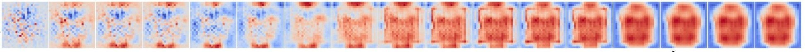
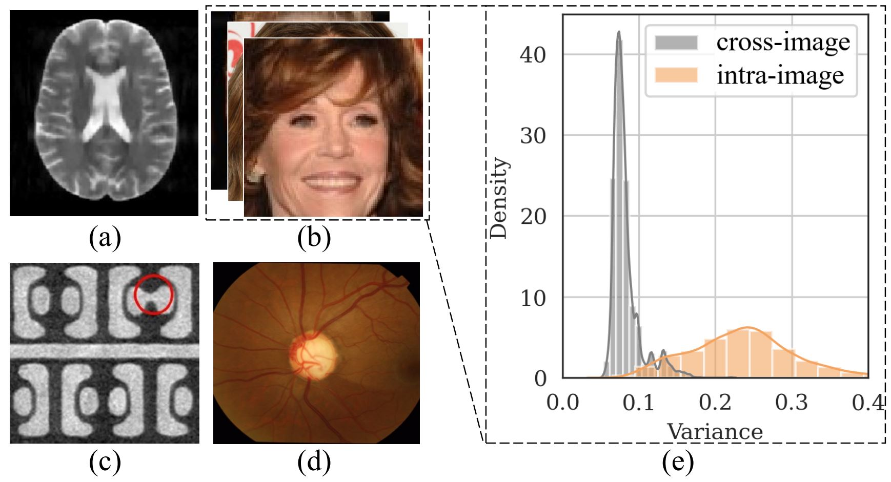
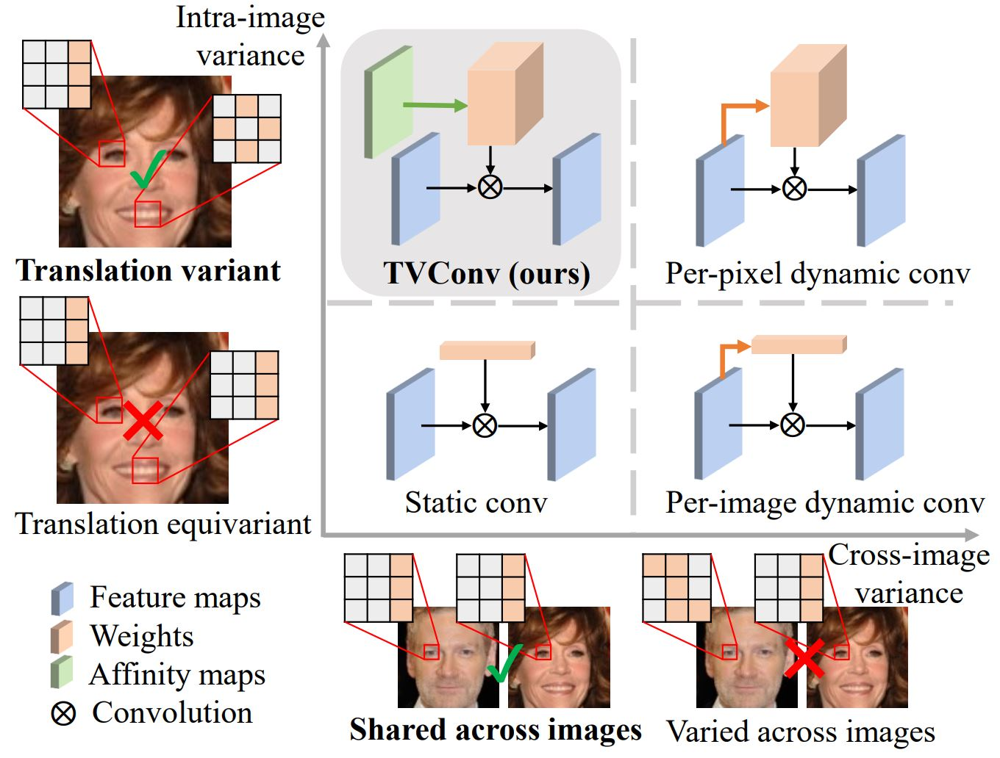

# TVConv: Efficient Translation Variant Convolution for Layout-aware Visual Processing [CVPR 2022]

<p align="center"></p>

This is the official Pytorch/PytorchLightning implementation of our paper: <br/>
> [**TVConv: Efficient Translation Variant Convolution for Layout-aware Visual Processing**](https://arxiv.org/abs/2203.10489)      
> Jierun Chen, Tianlang He, Weipeng Zhuo, Li Ma, Sangtae Ha, S.-H. Gary Chan        
> *In Proceedings of the IEEE/CVF Conference on Computer Vision and Pattern Recognition (CVPR), 2022*

<p float="left">
  
  

## Requirements

- Create a conda virtual environment and activate it:
```bash
conda create -n TVConv python=3.7.1 -y
conda activate TVConv
```
- Install `CUDA==9.2` following
  the [official installation instructions](https://docs.nvidia.com/cuda/cuda-installation-guide-linux/index.html)
- Install `pytorch==1.7.1`:
```bash
conda install pytorch==1.7.1 torchvision==0.8.2 cudatoolkit=9.2 -c pytorch
```
- Further install the following packages for the face recognition task:
```
pip install opencv-python pytorch-lightning==1.4.6 pytorch-lightning-bolts==0.3.0 wandb==0.12.1 torchmetrics==0.5.1
```

- Or further install the following packages for the optic disc/cup segmentation task:
```
conda install -c anaconda scikit-image
pip install tensorboardX==2.0 pyyaml MedPy opencv-python pytz==2020.1
```

## Dataset preparation

### For face recognition

Download datasets from [here](https://drive.google.com/file/d/1ywBQOsVaExErhh_5GHz00IWSK1xnB9Bn/view?usp=sharing). Unzip and put the datasets within the directory `./data`. The datasets include: <br /> 
- Training dataset<br />
CASIA-Webface-frontal (10K ids/329K images) adapted from CASIA-Webface (10K ids/490K images) [1]
- Validation datasets<br />
AgeDB-30 (570 ids/12,240 images/6K pairs)[3]<br />
LFW (5749 ids/13233 images/6K pairs)[2]<br />
CALFW (5749 ids/13233 images/6K pairs)[4]<br />
CFP-FF (500 ids/14K images/7K pairs)[5].<br />

Original version in `.bin` format before preprocessing can be found [here](https://github.com/deepinsight/insightface/blob/master/recognition/_datasets_/README.md).

### For optic disc/cup segmentation

Download the [dataset](https://drive.google.com/file/d/1p33nsWQaiZMAgsruDoJLyatoq5XAH-TH/view?usp=sharing) into your own folder and change `--data-dir` correspondingly.<br />
They include: <br />
- Domian1: Drishti-GS dataset [6] with 101 samples, including 50 training and 51 testing samples; <br />
- Domain2: RIM-ONE_r3 dataset [7]  with 159 samples, including 99 training and 60 testing samples; <br />
- Domain3: REFUGE training [8] with 400 samples, including 320 training and 80 testing samples; <br />
- Domian4: REFUGE val [8] with 400 samples,  including 320 training and 80 testing samples. <br />

## Train and evaluation

### For face recognition

To train a model, for example `mobilenet_v2_x0_1` with `TVConv`, from scratch with 2 RTX 2080Ti, run:
```bash
cd face_recognition/
python train_test.py -m mobilenet_v2_x0_1 -a TVConv -g 0,1 
```
The results will be saved and uploaded to the wandb server. Sign in your account to check out.
 
### For optic disc/cup segmentation

Train and test the model:
``` bash
cd od_oc_segmentation/
python train_test.py -g 0 --datasetTrain 1 2 3 --datasetTest 4 --batch-size 16
```
The results will be saved within the `./od_oc_segmentation/result` folder. 


## Citation

If you find our work useful in your research, please consider citing:
  
      @InProceedings{Chen_2022_CVPR,
        author    = {Chen, Jierun and He, Tianlang and Zhuo, Weipeng and Ma, Li and Ha, Sangtae and Chan, S.-H. Gary},
        title     = {TVConv: Efficient Translation Variant Convolution for Layout-Aware Visual Processing},
        booktitle = {Proceedings of the IEEE/CVF Conference on Computer Vision and Pattern Recognition (CVPR)},
        month     = {June},
        year      = {2022},
        pages     = {12548-12558}
      }

## Acknowledgement

Part of the codes are modified from [torchvision.models](https://github.com/pytorch/vision/blob/master/torchvision/models), 
[FaceX-Zoo](https://github.com/JDAI-CV/FaceX-Zoo), [DoFE](https://github.com/emma-sjwang/Dofe). 


## Reference

[1] Dong Yi, Zhen Lei, Shengcai Liao, Stan Z. Li. Learning Face Representation from Scratch. arXiv:1411.7923, 2014. <br />
[2] Gary B. Huang, Manu Ramesh, Tamara Berg, and Erik Learned-Miller. Labeled Faces in the Wild: A Database for Studying Face Recognition in Unconstrained Environments, 2007.<br />
[3] Moschoglou, Stylianos and Papaioannou, Athanasios and Sagonas, Christos and Deng, Jiankang and Kotsia, Irene and Zafeiriou, Stefanos, Agedb: the first manually collected, in-the-wild age database, CVPRW, 2017.<br />
[4] Zheng Tianyue, Deng Weihong, Hu Jiani, Cross-age lfw: A database for studying cross-age face recognition in unconstrained environments, arXiv:1708.08197, 2017.<br />
[5] Sengupta Soumyadip, Chen Jun-Cheng, Castillo Carlos, Patel Vishal M, Chellappa Rama, Jacobs David W, Frontal to profile face verification in the wild, WACV, 2016.<br />
[6] Jayanthi Sivaswamy, S Krishnadas, Arunava Chakravarty, GJoshi, A Syed Tabish, et al. A comprehensive retinal image dataset for the assessment of glaucoma from the optic nerve head analysis. JSM Biomedical Imaging Data Papers, 2(1):1004, 2015.<br />
[7] Francisco Fumero, Silvia Alayón, José L Sanchez, Jose Sigut, and M Gonzalez-Hernandez. Rim-one: An open retinal image database for optic nerve evaluation. In 2011 24th international symposium on computer-based medical systems (CBMS), pages 1–6. IEEE, 2011.<br />
[8] José Ignacio Orlando, Huazhu Fu, João Barbosa Breda, Karel van Keer, Deepti R Bathula, Andrés Diaz-Pinto, Ruogu Fang, Pheng-Ann Heng, Jeyoung Kim, JoonHo Lee, et al. Refuge challenge: A unified framework for evaluating automated methods for glaucoma assessment from fundus photographs. Medical image analysis, 59:101570, 2020.<br />
